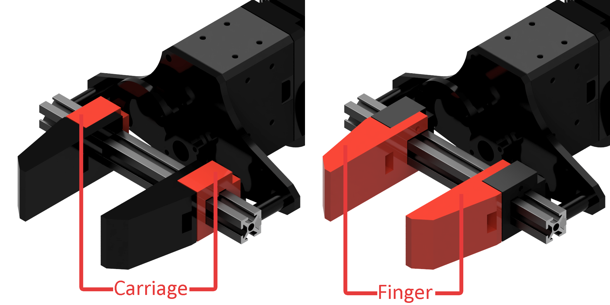
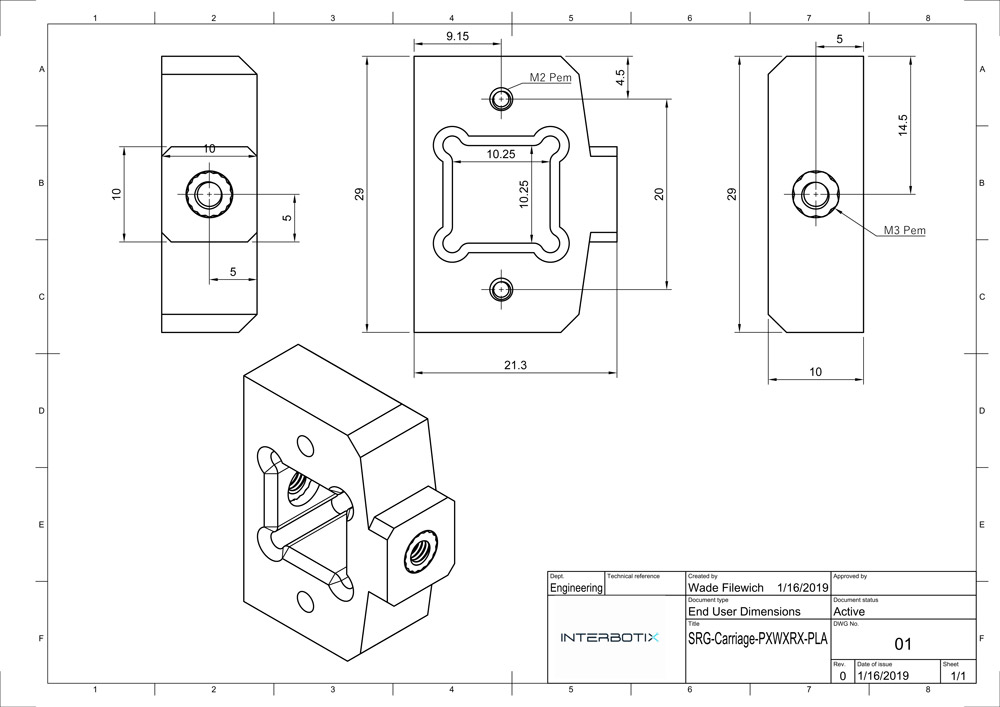

===================
Customized Grippers
===================

The grippers on all Interbotix Arms are made to be fully customizable by taking advantage of modern
3D printing. Users can create virtually any kind of gripper fingers they need for their use case
and bolt them onto the gripper carriages.

Gripper Carriages are designed with several mounting points to make attaching custom fingers easy.
Just use M2x14 bolts to secure your gripper fingers to the carriage.

CAD Files
=========

- :download:`Single 1010 Extruded Aluminum Rail CAD Files </_downloads/solids/Gripper_1010_Carriage.zip>`
- :download:`Finger Carriage CAD Files </_downloads/Finger_Carriage.zip>`

.. TODO double
.. :download:`Double 1010 Extruded Aluminum Rail Gripper CAD Files </_downloads/1010_double.STEP>`
