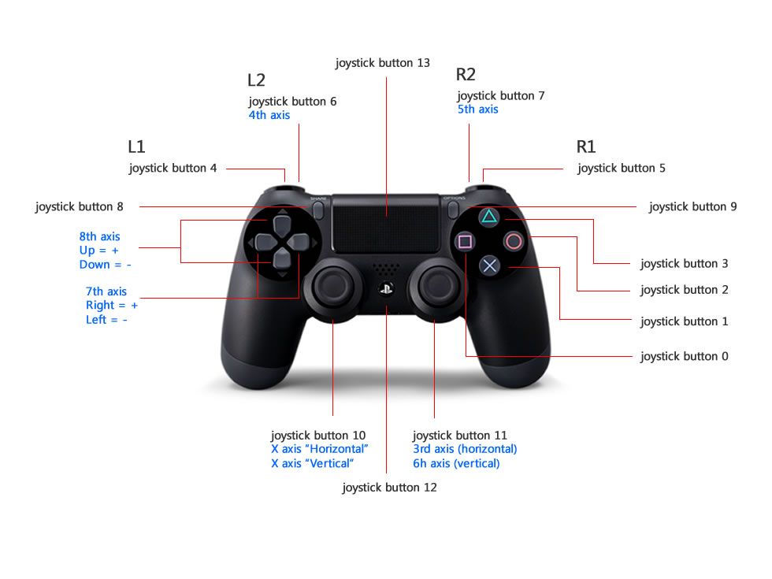

=======================
Pairing Your Controller
=======================

This guide walks you through setting up a Bluetooth joystick controller to control your X-Series
manipulator to an Ubuntu Linux computer.

.. note::

    The Interbotix software only supports the usage of SONY PS4 and PS3 controllers.

SONY PS4 Controller (Recommended)
=================================

1.  Click the **Bluetooth** icon on the top right of your screen, followed by **Bluetooth
    Settings**.

2.  Press and hold the **Share** button on the PS4 controller (see image below for reference).

3.  While holding the **Share** button, press and hold the **PS Button**. After a few seconds, the
    triangular shaped LED located between the **L2** and **R2** buttons should start rapidly
    flashing white (about twice a second) at which point you can let go.

4.  On the computer, click the **+** icon in the Bluetooth settings window.

5.  Wait until you see **Wireless Controller** pop up, select it, and click **Next** on the bottom
    right of the window.

6.  A message should display saying **successfully set up new device 'Wireless Controller'** and
    the LED should turn blue. This means the controller is connected to the computer.

7.  To disconnect, hold down the **PS Button** for about 10 seconds until the LED turns off.

8.  To reconnect, just press the **PS Button** (no need to hold it down). After blinking white a
    few times, the LED should turn blue.

SONY PS3 Controller
===================

1.  Get an original SONY PS3 controller and it's accompanying USB cable.

2.  Open up a terminal by pressing :kbd:`Ctrl` + :kbd:`Alt` :kbd:`T`, and enter the following
    commands.

    .. code-block:: console

        $ sudo bluetoothctl
        [bluetooth]# power on
        [bluetooth]# agent on
        [bluetooth]# scan on

3.  Plug the PS3 controller into the Linux Laptop. At this point, a message should pop up in the
    terminal that looks something like the following (with a different MAC address):

    .. code-block:: console

        [NEW] Device FC:62:B9:3F:79:E7 PLAYSTATION(R)3 Controller

4.  When it appears, type:

    .. code-block:: console

        [bluetooth]# trust <MAC-address>

5.  Unplug the PS3 controller and press the **PS Button**. The four red LEDs at the front of the
    controller should flash a few times, eventually leaving just one LED on by the '1'. This means
    that the joystick paired successfully.

.. note::

    Sometimes, the joystick might cause the cursor of the computer mouse to go crazy. To fix this,
    add the following line to the ``~/.bashrc`` file:

    .. code-block:: console

        alias joy_stop='xinput set-prop "PLAYSTATION(R)3 Controller" "Device Enabled" 0'

    Now, whenever the PS3 joystick is paired to the computer, just type ``joy_stop`` in the
    terminal to stop it messing with the mouse.

.. _raspberry-pi-4b-sony-ps4-controller-label:

Raspberry Pi 4b & SONY PS4 Controller
=====================================

1.  Once the Pi boots, click the **Bluetooth** icon on the top right of your Desktop, followed by
    **Setup New Device**.

2.  A window should pop up welcoming you to the **Bluetooth Device Setup Assistant**. Click the
    **Next** button.

3.  Press and hold the **Share** button on the PS4 controller. While holding the **Share** button,
    press and hold the **PS Button**.

4.  After a few seconds, the triangular shaped LED located between the **L2** and **R2** buttons
    should start rapidly flashing white (about twice a second) at which point you can let go.

5.  On the computer, click the **Magnifying Glass** icon on the lower left of the **Device**
    window. Wait until you see **Wireless Controller** pop up, select it, and click **Next** on the
    bottom right of the window.

6.  A message should pop up asking if you would like to **Pair Device** or **Proceed Without
    Pairing**. Select **Pair Device** and click **Next** on the bottom right of the screen.

7.  A new message should now display asking you to either connect to **Human Interface Device
    Service (HID)** or **Don't Connect**. Select the **Human Interface Device Service (HID)**
    option and click **Next**.

8.  In the following screen, you should see a message either saying that the **Device added
    successfully, but failed to connect** or that the **Device added and connected successfully**.
    This is typical and you should just click **Close** on the bottom right of the screen.

9.  If the message said that the device connected **successfully**, you will need to disconnect and
    reconnect the controller for the next step. To do that, hold down the **PS Button** for about
    10 seconds until the blue LED at the front of the controller turns off.

10. Then, tap the **PS Button** on the controller (no need to hold it down), and after waiting a
    few seconds, you should see the LED at the front turn blue.

11. At this point, you should see a small popup on the top right of the screen titled **Bluetooth
    Authentication**. Make sure to click the **Always Accept** option. This means that the computer
    will always pair with your PS4 controller when you tap the PS button.

Troubleshooting
===============

Controller Isn't Turning On
---------------------------

Your controller might be dead. Try charing it for an hour or plug it into your computer.

PS4 Controller LEDs Blink A Few Times and Turn Off
--------------------------------------------------

Your controller may have a low charge level and needs to be charged. Try charing it for an hour or
plug it into your computer.
