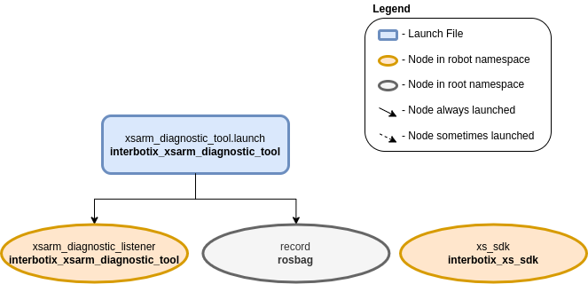

=======================
Arm Diagnostic Listener
=======================

.. raw:: html

  <a href="https://github.com/Interbotix/interbotix_ros_manipulators/tree/main/interbotix_ros_xsarms/examples/interbotix_xsarm_diagnostic_tool"
    class="docs-view-on-github-button"
    target="_blank">
    
      View Package on GitHub
  </a>

Overview
========

The diagnostic listener is intended to get joint information like present temperature from the
robot while it executes any commanded trajectory. This is useful for when you would like the robot
to move through a more complex motion than the more basic Diagnostic Tool is able to provide. The
Listener subscribes to the joint states of the `configured`_ joints, periodically retrieves the
Present_Temperature register from the DYNAMIXEL servos, and publishes the data to the namespaced
``temperatures/joint_group`` topic.

.. _`configured`: https://github.com/Interbotix/interbotix_ros_manipulators/blob/main/interbotix_ros_xsarms/examples/interbotix_xsarm_diagnostic_tool/config/listener.yaml

Structure
=========

As shown above, the `interbotix_xsarm_diagnostic_tool` package relies on the existence of the
`interbotix_xs_sdk` package. To get pointers about the nodes in the that package, please look at
its README. The other nodes are described below:

-   **record** - responsible for recording the ``/<robot_name>/joint_states``,
    and ``/<robot_name>/temperatures/joint_group`` topics and saving it to a
    user-specified bagfile

Usage
=====

To use this package, first configure the `listener.yaml`_ file to the joints you
wish to observe. The default observe_joint parameters assume that the user is listening to the
joints of an X-Series 6DOF arm, say a WidowX-250 6DOF.

.. _`listener.yaml`: https://github.com/Interbotix/interbotix_ros_manipulators/blob/main/interbotix_ros_xsarms/examples/interbotix_xsarm_diagnostic_tool/config/listener.yaml

Next, launch the control application that you wish to profile the performance of. For example, one
could have an application that moves the robot through a complicated trajectory and is not sure if
the robot is able to manage the load or movements. The user would launch their application with
whatever method the application is deigned for (Python, rosrun, etc.).

The user would then launch this program using the command below, making sure to specify the
``bag_name`` argument.

.. code-block:: console

    $ roslaunch interbotix_xsarm_diagnostic_tool xsarm_diagnostic_listener.launch robot_model:=wx250s bag_name:=wx250s_application_diagnostics

Once the control application is done, send the termination signal to the listener by entering
:kbd:`Ctrl` + :kbd:`C` in its terminal.

To convert the `rosbag` data to a csv file, navigate to the `scripts`_ directory. If the
'bag2csv.py' program is not yet executable, make it so by typing:

.. _scripts: https://github.com/Interbotix/interbotix_ros_manipulators/tree/main/interbotix_ros_xsarms/examples/interbotix_xsarm_diagnostic_tool/scripts

.. code-block:: console

    $ chmod a+x bag2csv.py

Next, type:

.. code-block:: console

    $ python bag2csv.py wx250s waist wx250s_application_diagnostics.bag wx250s_application_diagnostics.csv

The command is pretty self explanatory - the arguments are the robot name, the name of the joint to
be observed, the bagfile name (the program expects it to be located in the 'bag' directory), and
the desired CSV file name. To better understand how this program works, take a look at
`bag2csv.py`_. Then, take a look at the table below to understand the launch file arguments.

.. _bag2csv.py: https://github.com/Interbotix/interbotix_ros_manipulators/blob/main/interbotix_ros_xsarms/examples/interbotix_xsarm_diagnostic_tool/scripts/bag2csv.py

.. csv-table::
    :file: ../_data/arm_diagnostic_listener.csv
    :header-rows: 1
    :widths: 20, 60, 20

.. _xsarm_diagnostic_tool.launch: https://github.com/Interbotix/interbotix_ros_manipulators/blob/main/interbotix_ros_xsarms/examples/interbotix_xsarm_diagnostic_tool/launch/xsarm_diagnostic_tool.launch
