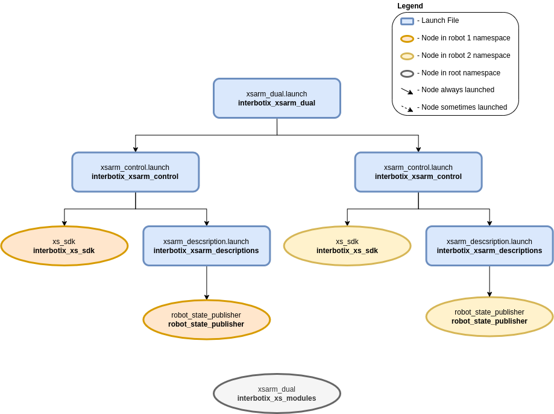

================
Dual Arm Control
================

.. raw:: html

  <a href="https://github.com/Interbotix/interbotix_ros_manipulators/tree/main/interbotix_ros_xsarms/examples/interbotix_xsarm_dual"
    class="docs-view-on-github-button"
    target="_blank">
    
      View Package on GitHub
  </a>

Overview
========

This package shows how to get two X-Series arms working together. While the example here is
specifically geared for two WidowX 200 arms, there is no limit to the number of arms that can be
used (except USB ports on your computer). Also, any of the X-Series arms can be used together - not
just WidowX 200 arms. For the purpose of the demo, the `Interbotix Python Arm Module`_ is used, so
you should familiarize yourself with the functions there and also look at the README in the
`python_demos`_ directory.

.. _`Interbotix Python Arm Module`: https://github.com/Interbotix/interbotix_ros_toolboxes/blob/main/interbotix_xs_toolbox/interbotix_xs_modules/src/interbotix_xs_modules/arm.py
.. _`python_demos`: https://github.com/Interbotix/interbotix_ros_manipulators/blob/main/interbotix_ros_xsarms/examples/python_demos

Structure
=========

As shown above, the `interbotix_xsarm_dual` package builds on top of the `interbotix_xsarm_control`
package. The number of instances that the `interbotix_xsarm_control` package is included in the
`xsarm_dual` launch file is equivalent to the number of robots being used. See the other packages
for descriptions of their nodes.

Usage
=====

To get started, make sure that the U2D2s for both robots are not connected to your computer. Then
connect the U2D2 that you'd like to be ``robot_1`` (as defined in the `demo python script`_).
Afterwards, connect the robot you'd like to be ``robot_2``. The reason for this is that Linux
assigns USB port names starting at 0 and going up. So the first U2D2 plugged in will be called
``/dev/ttyUSB0`` while the second U2D2 plugged in will be called ``/dev/ttyUSB1``. If you're
familiar with udev rules, you can create a unique symlink for each U2D2 by finding its serial id
with the following command (make sure you do this with only one U2D2 plugged in at a time)

.. _`demo python script`: https://github.com/Interbotix/interbotix_ros_manipulators/blob/main/interbotix_ros_xsarms/examples/interbotix_xsarm_dual/scripts/xsarm_dual.py

.. code-block:: console

    $ udevadm info -a -n /dev/ttyUSB0 | grep {serial}

The output should look similar to the below but with a different ID...

.. code-block:: console

    ATTRS{serial}=="FT4NQ5QO"

Then go to ``/etc/udev/rules.d`` and edit the ``99-interbotix-udev.rules`` file by adding the line
below for each of your U2D2s. Note that we've used the serial ID above and gave a custom symlink of
``ttyRBT1`` arbitrarily.

.. code-block:: console

    SUBSYSTEM=="tty", ATTRS{idVendor}=="0403", ATTRS{idProduct}=="6014", ATTRS{serial}=="FT4NQ5QO", ENV{ID_MM_DEVICE_IGNORE}="1", ATTR{device/latency_timer}="1", SYMLINK+="ttyRBT1"

Now make sure to update the ``port`` name in the 'modes.yaml' files in the `config`_ directory to
point to your new symlinks. Then unplug/replug the U2D2s to refresh the ports and run the launch
file below.

.. _`config`: https://github.com/Interbotix/interbotix_ros_manipulators/blob/main/interbotix_ros_xsarms/examples/interbotix_xsarm_dual/config

.. code-block:: console

    $ roslaunch interbotix_xsarm_dual xsarm_dual.launch

Then navigate to the `scripts`_ directory and run the command

.. code-block:: console

    $ python xsarm_dual.py  # python3 xsarm_dual.py if using ROS Noetic

.. _`scripts`: https://github.com/Interbotix/interbotix_ros_manipulators/blob/main/interbotix_ros_xsarms/examples/interbotix_xsarm_dual/scripts

To further customize the launch file at run-time (like with a different robot model), look at the
table below:

.. csv-table::
    :file: ../_data/dual_arm_control.csv
    :header-rows: 1
    :widths: 20, 60, 20

.. _`xsarm_dual.launch`: https://github.com/Interbotix/interbotix_ros_manipulators/blob/main/interbotix_ros_xsarms/examples/interbotix_xsarm_dual/launch/xsarm_dual.launch

Video Tutorials
===============

Working With Multiple Arms
--------------------------

.. youtube:: DnjbNXxBE_8
    :width: 70%
    :align: center
    :url_parameters: ?start=30
