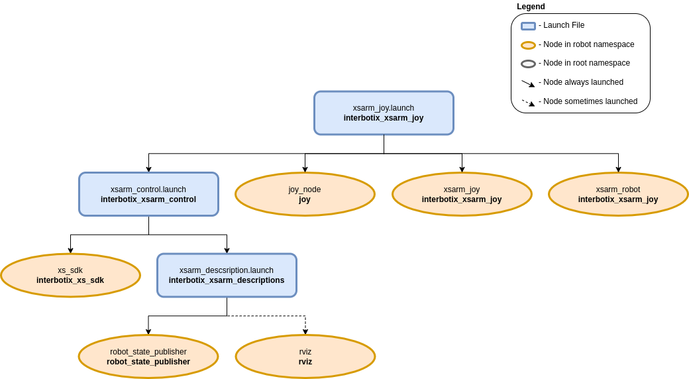

================
Joystick Control
================

.. raw:: html

	<a
	href="https://github.com/Interbotix/interbotix_ros_manipulators/tree/main/interbotix_ros_xsarms/examples/interbotix_xsarm_joy"
		class="docs-view-on-github-button" target="_blank"> 
		View Package on GitHub
	</a>

Overview
========

This package can be used to control the movements of any X-Series robotic arm using a SONY PS3/PS4
controller or Microsoft Xbox360 controller (untested) via Bluetooth. In this demo, the 'arm' joints
are set to work in 'position' control mode while the gripper operates in 'PWM' mode. Refer to the
joystick button map below to see how to operate the robot. Specifically, some of the joystick
controls manipulate individual joints while others are used to perform 'inverse kinematics' on all
the joints to get the end-effector of the robot (defined at 'ee_gripper_link') to move as if it's
in Cartesian space. This is done using the `modern_robotics`_ code library offered by Northwestern
University.

.. _modern_robotics: https://github.com/NxRLab/ModernRobotics/tree/master/packages/Python

Structure
=========

As shown above, the `interbotix_xsarm_joy` package builds on top of the `interbotix_xsarm_control`
package. To get pointers about the nodes in that package, please look at its README. The other
nodes are described below:

- 	**joy** - a ROS driver for a generic Linux joystick; it reads data from a joystick over
	Bluetooth and publishes `sensor_msgs/Joy`_ messages to the ``commands/joy_raw`` topic
- 	**xsarm_joy** - responsible for reading in raw `sensor_msgs/Joy`_ messages from the
	``commands/joy_raw`` topic and converting them into `ArmJoy`_ messages; this makes the code
	more readable and allows users to remap buttons very easily later.
- 	**xsarm_robot** - responsible for reading in `ArmJoy`_ messages and sending joint and gripper
	commands to the **xs_sdk** node; while the 'waist' joint can be directly controlled via the
	PS3/PS4 joystick, other buttons allow position-ik to be performed using all the arm joints.

.. _sensor_msgs/Joy: http://docs.ros.org/latest/api/sensor_msgs/html/msg/Joy.html
.. _ArmJoy: https://github.com/Interbotix/interbotix_ros_core/blob/main/interbotix_ros_xseries/interbotix_xs_msgs/msg/ArmJoy.msg

Usage
=====

After pairing your Bluetooth joystick controller using the :doc:`Pairing Your Controller
<../getting_started/pairing_controller>` Guide, type the following in a terminal (let's say to
control the WidowX-200 arm):

.. code-block:: console

	$ roslaunch interbotix_xsarm_joy xsarm_joy.launch robot_model:=wx200

.. _`Pairing Your Controller`: ../getting_started/pairing_controller.html

A red error message might appear in the screen saying ``Couldn't open joystick force feedback!``.
This is normal and will not affect the joystick operation. To further customize the launch file at
run-time, look at the table below:

.. csv-table::
	:file: ../_data/joystick_control.csv
	:header-rows: 1
	:widths: 20, 60, 20

.. _xsarm_control.launch: https://github.com/Interbotix/interbotix_ros_manipulators/blob/main/interbotix_ros_xsarms/examples/interbotix_xsarm_joy/launch/xsarm_control.launch

To understand how the joystick buttons map to controlling the robot, look at the diagram and table
below. Note that while the Xbox360 has a slightly different naming convention, the button placement
is essentially the same:

.. image:: images/ps3.jpg
	:width: 70%
	:align: center

.. csv-table::
	:file: ../_data/joystick_control_buttons.csv
	:header-rows: 1
	:widths: 30, 70

Video Tutorials
===============

Using a Joystick to Control X-Series Arms
-----------------------------------------

.. youtube:: AyKjcZvu8lo
	:width: 70%
	:align: center

|

Joystick X-Series Arm Demo
--------------------------

.. youtube:: IkqDeMSHu-k
	:width: 70%
	:align: center
