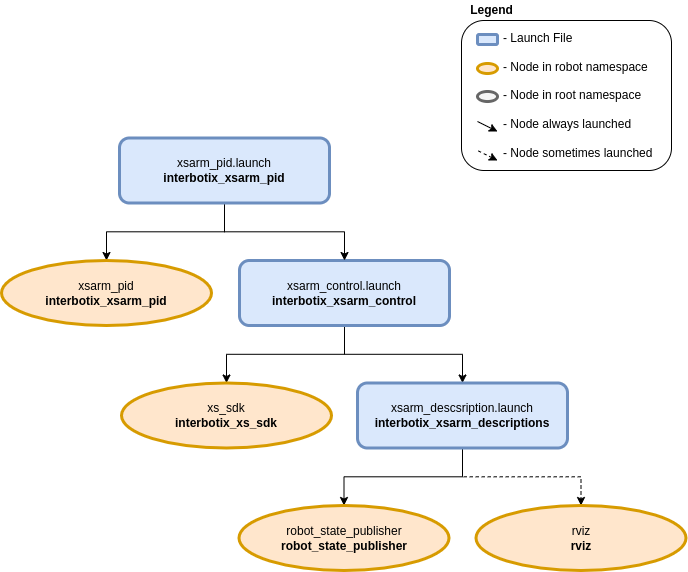

==========================
PID Gains Test Environment
==========================

.. raw:: html

    <a href="https://github.com/Interbotix/interbotix_ros_manipulators/tree/main/interbotix_ros_xsarms/examples/interbotix_xsarm_pid"
        class="docs-view-on-github-button"
        target="_blank">
        
        View Package on GitHub
    </a>

Overview
========

This package can be used as a way to test 'pwm' or 'current' PID gains when operating the arm in
either 'pwm' or 'current' mode. PID gains are read into the controller node from the `gains.yaml`_
file. The node then commands the arm to its 'home' pose and waits ten seconds for it to settle.
Then it commands the arm to its 'sleep' pose and waits another ten seconds for it to settle.
Finally, the node commands all the motors to either zero pwm or zero current (effectively torquing
them off) before shutting itself down.

.. _`gains.yaml`: https://github.com/Interbotix/interbotix_ros_manipulators/blob/main/interbotix_ros_xsarms/examples/interbotix_xsarm_pid/config/gains.yaml

Structure
=========

As shown above, the `interbotix_xsarm_pid` package builds on top of the `interbotix_xsarm_control`
package. To get pointers about the nodes in the that package, please look at its README. The node
specific to this package is described below.

-   **xsarm_pid** - contains a simple PID controller to command the arm joints (excluding gripper)
    first to their 'home' positions and then to their 'sleep' positions; it receives the desired
    PID gains from `gains.yaml`_ and the ``control_mode`` as a parameter.

Usage
=====

To run this package, first create a 'gains.yaml' file similar to the one `here`_ with your desired
'pwm' or 'current' PID gains. Then run the command below (assuming the ReactorX-150 is being used
in 'pwm' mode).

.. _`here`: https://github.com/Interbotix/interbotix_ros_manipulators/blob/main/interbotix_ros_xsarms/examples/interbotix_xsarm_pid/config/gains.yaml

.. code-block:: console

    $ roslaunch interbotix_xsarm_pid xsarm_pid.launch robot_model:=rx150 control_mode:=pwm

To further customize the launch of the robot, take a look at the table below.

.. csv-table::
    :file: ../_data/pid_gains_test_environment.csv
    :header-rows: 1
    :widths: 20, 60, 20

.. _`xsarm_pid.launch`: https://github.com/Interbotix/interbotix_ros_manipulators/blob/main/interbotix_ros_xsarms/examples/interbotix_xsarm_pid/launch/xsarm_pid.launch
