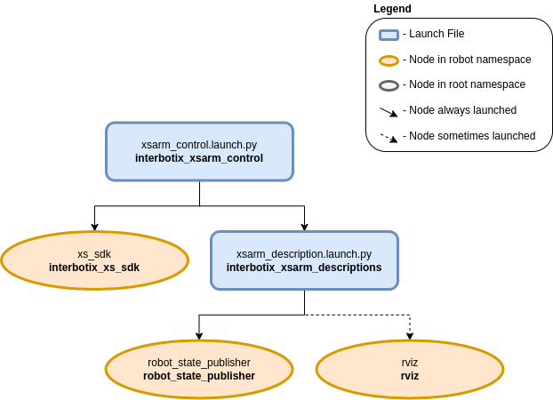

===========
Arm Control
===========

.. raw:: html

    <a href="https://github.com/Interbotix/interbotix_ros_manipulators/tree/galactic/interbotix_ros_xsarms/interbotix_xsarm_control"
        class="docs-view-on-github-button"
        target="_blank">
        
        View Package on GitHub
    </a>

Overview
========

This package contains the configuration and launch files necessary to easily start the Interbotix
Arm platform. This includes launching the **xs_sdk** node responsible for driving the DYNAMIXEL
motors on the robot and loading the URDF to the ``robot_description`` parameter. Essentially, this
package is what all 'downstream' ROS packages should reference to get the robot up and running.

Structure
=========

As shown in the image above, the `interbotix_xsarm_control` package builds on top of the
:doc:`interbotix_xsarm_descriptions <./arm_descriptions>` and `interbotix_xs_sdk`_ packages. Please
take a look at those packages to get familiar with their nodes. You will also notice a config
directory containing many YAML files. Each file (beside the modes.yaml one) specifies the names and
initial register values for all the motors that make up a specific robot arm. There is also some
'meta-info' like names of joint groups, the desired joint-topic name and publishing frequency,
etc... For a full explanation of each of these parameters, check out the `Motor Config file
template`_. The other file located in that directory is the Mode Config one (a.k.a modes.yaml). The
parameters in this file define the desired operating modes for either a group of joints or single
joints, and whether or not they should be torqued on/off at node startup. See more by referencing
the `Mode Config file template`_. Typically, the Motor Config file is only defined here while the
Mode Config file is also defined in any 'downstream' ROS package. This makes it easy for users to
configure their desired motor operating modes depending on their project.

.. _`interbotix_xs_sdk`: https://github.com/Interbotix/interbotix_ros_core/tree/galactic/interbotix_ros_xseries/interbotix_xs_sdk
.. _`config``: https://github.com/Interbotix/interbotix_ros_manipulators/tree/galactic/interbotix_ros_xsarms/interbotix_xsarm_control/config
.. _`Motor Config file template`: https://github.com/Interbotix/interbotix_ros_core/blob/galactic/interbotix_ros_xseries/interbotix_xs_sdk/config/motor_configs_template.yaml
.. _`Mode Config file template`: https://github.com/Interbotix/interbotix_ros_core/blob/galactic/interbotix_ros_xseries/interbotix_xs_sdk/config/mode_configs_template.yaml

Usage
=====

To run this package on a physical robot, run the command below in a terminal (assuming the
WidowX-200 arm is being used).

.. code-block:: console

    $ ros2 launch interbotix_xsarm_control xsarm_control.launch.py robot_model:=wx200

To run this package on a simulated robot, run the command below in a terminal (assuming the
WidowX-200 arm is being used).

.. code-block:: console

    $ ros2 launch interbotix_xsarm_control xsarm_control.launch.py robot_model:=wx200 use_sim:=true

To further customize this launch file at run-time, refer to the table below, or run the command below

.. code-block:: console

    $ ros2 launch interbotix_xsarm_control xsarm_control.launch.py --show-args

.. csv-table::
    :file: ../_data/arm_control_ros2.csv
    :header-rows: 1
    :widths: 20, 60, 20, 20

Video Tutorials
===============

Arm Control Package for ROS 2
-----------------------------

.. youtube:: tE2nuXhJTiA
    :width: 70%
    :align: center
