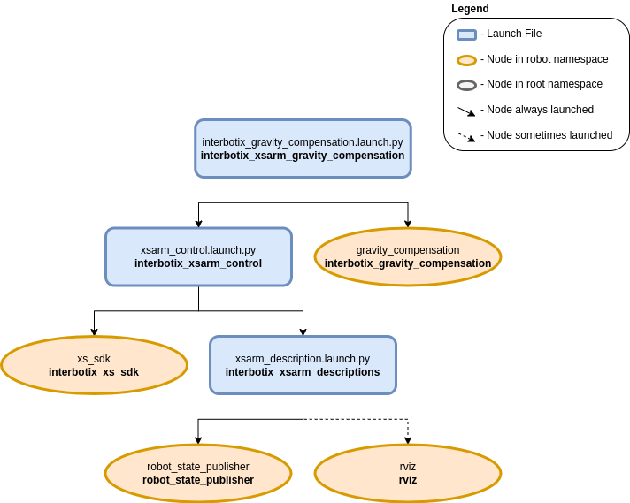

====================
Gravity Compensation
====================

.. raw:: html

    <a href="https://github.com/Interbotix/interbotix_ros_manipulators/tree/humble/interbotix_ros_xsarms/examples/interbotix_xsarm_gravity_compensation"
        class="docs-view-on-github-button"
        target="_blank">
        
        View Package on GitHub
    </a>

Overview
========

As its name suggests, gravity compensation cancels out the effect of the gravity on a system.
In our case, we compensate the gravity on an interbotix arm with its joint motors.
This feature is useful when we use the arm as a teleoperation remote or when we teach it a specific trajectory and don't want to keep holding the arm to avoid it from collapsing.

.. note:: Currently supported arms include: WidowX-250 6DOF and ALOHA WidowX-250 6DOF.

Configuration
=============

Two configuration files are provided in the `config` directory:

-   **mode_configs.yaml** - contains the port and initial mode settings, whose details are given :ref:`here <mode_configs_file_ros2>`.
-   **motor_specs.yaml** - contains the motor specifications and options for motor assistance and dithering.

A template file of the **motor_specs.yaml** is given below

.. code-block:: yaml

    # Motor Assist: scale the no-load currents which alleviate the effects of friction
    # If the values are invalid, they default to 0
    # Joints not specified in the motor_assist or motor_specs sections
    # do not support the current control mode
    motor_assist:
    # Set 'all' to [0, 1] to scale the no load currents of all joints uniformly
    # Or to -1 and use joint specific values
    all: -1
    # Set the joint specific values to [0, 1] to scale differently for each joint
    waist: 0.5
    shoulder: 0.5
    elbow: 0.5
    forearm_roll: 0.5
    wrist_angle: 0.5
    wrist_rotate: 0.5

    # Dither: add a oscillatory motion proportional to the load to break static friction
    # It is helpful when slow and smooth movements are needed
    # WARNING: excessive dithering WILL cause heat and wear on the joints
    dither: false

    motor_specs:
    waist:
        # torque constant (Nm/A): how much torque is produced per Amp of current
        torque_constant: 1.793
        # current unit (A): how much current command is needed to produce 1 Amp of current
        current_unit: 0.00269
        # no load current (A): the maximum no load current applied when motor_assist == 1
        # should be as large as possible without the joint accelerating by itself
        no_load_current: 0.0
        # kinetic friction (Nm/Nm): the kinetic friction coefficient
        # should be tuned so that the friction is uniform over the entire joint range
        kinetic_friction_coefficient: 0.0
        # static friction coefficient (Nm/Nm): the static friction coefficient
        # affects the amplitude of the dithering motion
        static_friction_coefficient: 0.0
        # dither speed (rad/s): the speed under which the joint dithers
        dither_speed: 0.0

    shoulder:
        torque_constant: 1.793
        current_unit: 0.00269
        no_load_current: 0.0
        kinetic_friction_coefficient: 0.1
        static_friction_coefficient: 0.4
        dither_speed: 0.5

    elbow:
        torque_constant: 1.793
        current_unit: 0.00269
        no_load_current: 0.0
        kinetic_friction_coefficient: 0.1
        static_friction_coefficient: 0.6
        dither_speed: 0.5

    forearm_roll:
        torque_constant: 0.897
        current_unit: 0.00269
        no_load_current: 0.2
        kinetic_friction_coefficient: 0.0
        static_friction_coefficient: 0.0
        dither_speed: 0.0

    wrist_angle:
        torque_constant: 0.897
        current_unit: 0.00269
        no_load_current: 0.1
        kinetic_friction_coefficient: 0.1
        static_friction_coefficient: 0.4
        dither_speed: 0.5

    wrist_rotate:
        torque_constant: 0.897
        current_unit: 0.00269
        no_load_current: 0.2
        kinetic_friction_coefficient: 0.0
        static_friction_coefficient: 0.0
        dither_speed: 0.0

.. warning:: Excessive dithering WILL cause heat and wear on the joints. Please use it with caution.

Structure
=========

As shown above, the `interbotix_xsarm_gravity_compensation` package builds on top of the `interbotix_xsarm_control` package whose details are given :doc:`here <./arm_control>`.

This package contains a single node called **gravity_compensation**.
It subscribes to the ``/<namespace>/joint_states`` topic, computes and publishes the desired current commands to the ``/<namespace>/commands/joint_group`` topic.
Please refer to the GitHub `Readme <interbotix_gravity_compensation>`_ for more details on its derivations and implementation.

.. _`interbotix_gravity_compensation`: https://github.com/Interbotix/interbotix_ros_toolboxes/tree/humble/interbotix_common_toolbox/interbotix_gravity_compensation

Usage
=====

Run the following launch command, assuming the Aloha WidowX-250 arm is being used:

.. code-block:: console

    $ ros2 launch interbotix_xsarm_gravity_compensation interbotix_gravity_compensation.launch.py robot_model:=aloha_wx250s

It runs the ``gravity_compensation`` node and launches the ``xsarm_control`` script to bring up the arm.

Then, enable/disable the gravity compensation with the following service call:

.. code-block:: console

    $ ros2 service call /aloha_wx250s/gravity_compensation_enable std_srvs/srv/SetBool 'data: [true/false]'

The arm will hold itself against gravity and can be moved freely when the gravity compensation is enabled.
It will lock in its current position when the gravity compensation is disabled.

.. warning:: The arm WILL torque off and drop for a short period of time while enabling/disabling. Please make sure it is in a resting position or manually held.

.. warning:: The joints not supporting current control WILL torque off. Please make sure to use an arm with at least the first three joints supporting current control, e.g., RX, WX, VX series.

This is the bare minimum needed to get up and running. Take a look at the table below to see how to further customize with other launch file arguments.

.. csv-table::
    :file: ../_data/gravity_compensation.csv
    :header-rows: 1
    :widths: 20, 60, 20, 20
