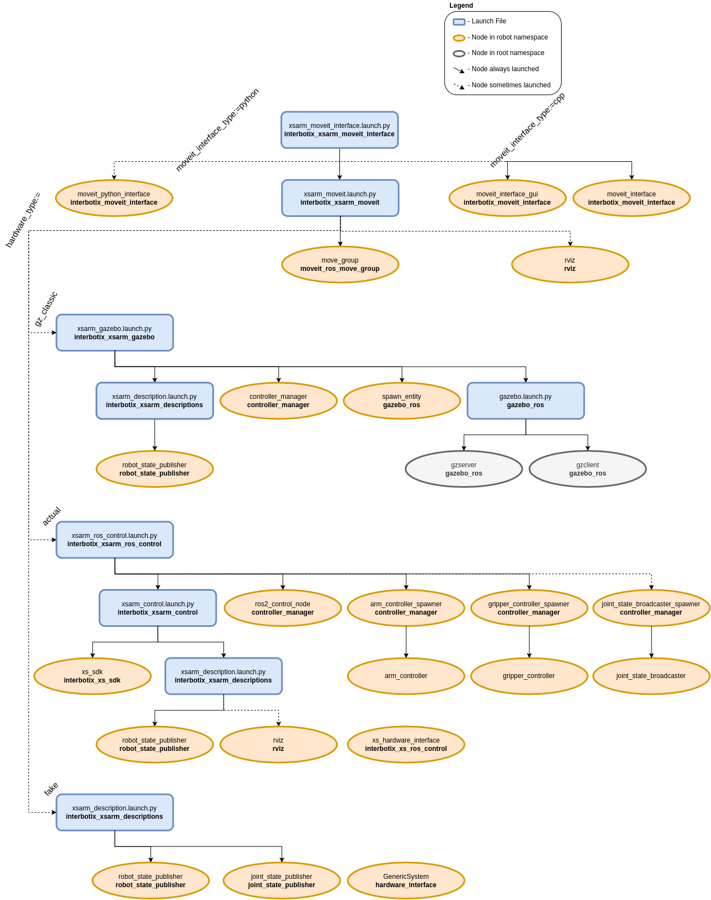
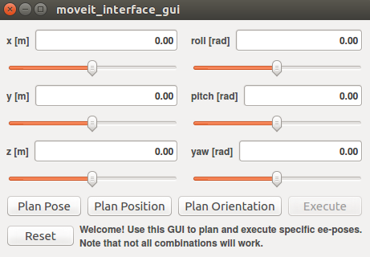

=========================
MoveIt2 Interface and API
=========================

.. raw:: html

    <a href="https://github.com/Interbotix/interbotix_ros_manipulators/tree/galactic/interbotix_ros_xsarms/examples/interbotix_xsarm_moveit_interface"
        class="docs-view-on-github-button"
        target="_blank">
        
        View Package on GitHub
    </a>

Overview
========

This package contains a small API modeled after the `Move Group C++ Interface Tutorial`_ that
allows a user to command desired end-effector poses to an Interbotix arm. It is not meant to be
all-encompassing but rather should be viewed as a starting point for someone interested in creating
their own MoveIt interface to interact with an arm. The package also contains a small GUI that can
be used to pose the end-effector.

Finally, this package also contains a modified version of the `Move Group Python Interface
Tutorial`_ script that can be used as a guide for those users who would like to interface with an
Interbotix robot via the MoveIt Commander Python module.

.. note::

    Only the C++ interface has been ported to ROS 2. The Python interface is waiting on `MoveIt
    Commander`_ to be ported.

.. _`Move Group C++ Interface Tutorial`: https://github.com/ros-planning/moveit_tutorials/blob/482dc9db944c785870274c35223b4d06f2f0bc90/doc/move_group_interface/src/move_group_interface_tutorial.cpp
.. _`Move Group Python Interface Tutorial`: https://github.com/ros-planning/moveit_tutorials/blob/482dc9db944c785870274c35223b4d06f2f0bc90/doc/move_group_python_interface/scripts/move_group_python_interface_tutorial.py
.. _`MoveIt Commander`: https://github.com/ros-planning/moveit2/tree/main/moveit_commander

Structure
=========

As shown above, this package builds on top of of the `interbotix_xsarm_moveit` package. To get
familiar with that package, please refer to its documentation. The
`interbotix_xsarm_moveit_interface` nodes are described below:

-   **moveit_interface** - a small C++ API that makes it easier for a user to command custom poses
    to the end-effector of an Interbotix arm; it uses MoveIt's planner behind the scenes to
    generate desired joint trajectories
-   **moveit_interface_gui** - a GUI (modeled after the one in the joint_state_publisher_gui
    package) that allows a user to enter in desired end-effector poses via text fields or sliders;
    it uses the moveit_interface API to plan and execute trajectories
-   **moveit_python_interface** - a modified version of the script used in the `Move Group Python
    Interface Tutorial`_ that is meant to work with an Interbotix arm; just press 'Enter' in the
    terminal to walk through the different steps; the desired joint state goal, pose goal, and
    end-effector offset (when attaching the box) are stored in YAML files located in the `config`_
    directory

.. _`config`: https://github.com/Interbotix/interbotix_ros_manipulators/blob/galactic/interbotix_ros_xsarms/examples/interbotix_xsarm_moveit_interface/config

.. note::

    Note that all the nodes defined above live in the `interbotix_ros_toolboxes`_ repo. That is
    because these nodes, besides for being used here, are also used in other repositories (like
    `interbotix_ros_rovers`). To make it easier to maintain, it made more sense to keep one
    instance of them in the toolbox repository instead of having duplicates in multiple
    repositories.

.. _`interbotix_ros_toolboxes`: https://github.com/Interbotix/interbotix_ros_toolboxes/tree/galactic/interbotix_common_toolbox/interbotix_moveit_interface

Usage
=====

To run this package on the physical robot, type the line below in a terminal (assuming the
ViperX-300 is being launched).

.. code-block:: console

    $ ros2 launch interbotix_xsarm_moveit_interface xsarm_moveit_interface.launch.py robot_model:=vx300

A GUI should pop-up similar to the one below. In it, a user should specify the desired position and
orientation of the end-effector (as defined by the 'ee_gripper_link' w.r.t. the 'world' frame).
This can be done either via the slider bars or by entering values into the text fields. Next, a
user can press one of five buttons. They are:

-   **Plan Pose** - MoveIt will attempt to find a trajectory that places the end-effector at the
    desired position and orientation

-   **Plan Position** - MoveIt will attempt to find a trajectory that places the end-effector at
    the desired position, ignoring orientation

-   **Plan Orientation** - MoveIt will attempt to find a trajectory that places the end-effector at
    the desired orientation, ignoring position

-   **Execute** - Once a valid plan has been found, this button can be pressed to actually execute
    the trajectory on the robot

-   **Reset** - This resets all slider bars to the middle and text fields to '0.00'

-   **Clear Markers** - This resets all MoveIt visual tools displays

.. note::

    Occasionally, MoveIt will be unsuccessful in finding a valid trajectory. This could be for one
    of two reasons. Either the desired pose is not physically attainable by the arm or the random
    seed generated by MoveIt was a bad guess. If it is clear that the pose is physically
    attainable, try hitting the desired 'Plan' button a few more times.

.. note::

    It is significantly more difficult for the planner to find a valid trajectory when specifying
    poses and orientations rather than just positions, especially for lower dof arms.

This is the bare minimum needed to get up and running. Take a look at the table below to see how to
further customize with other launch file arguments.

.. csv-table::
    :file: ../_data/moveit_interface_and_api_ros2.csv
    :header-rows: 1
    :widths: 20, 60, 20, 20

Video Tutorials
===============

MoveIt2 Configuration for ROS 2
-------------------------------

.. youtube:: -Kw0zHTRrY4
    :width: 70%
    :align: center
