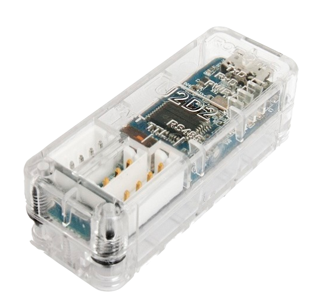
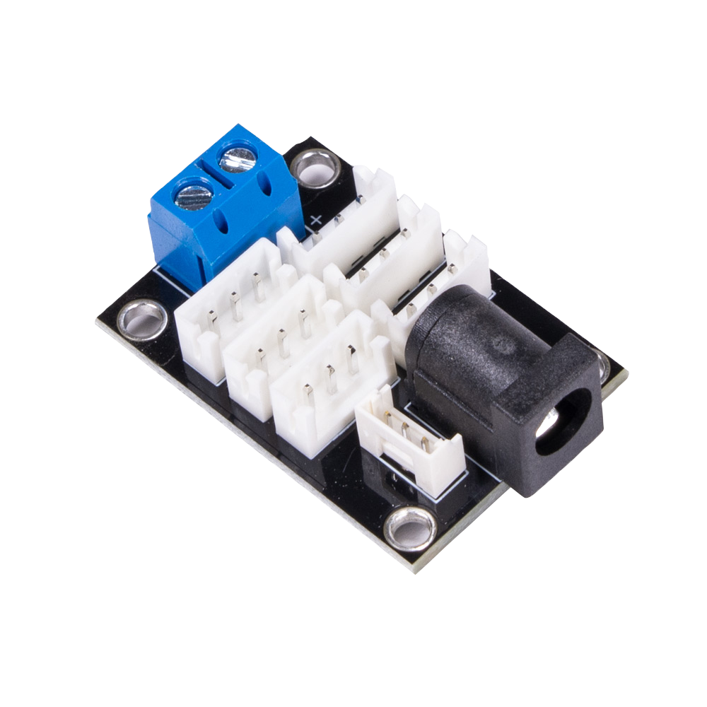
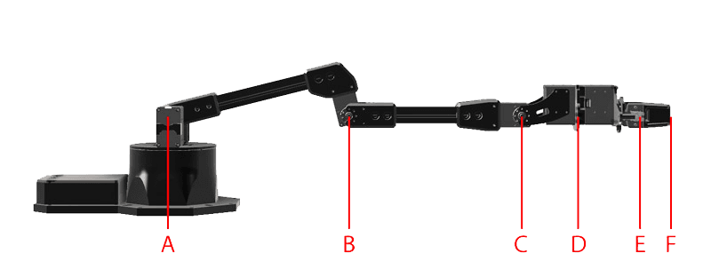

==============
Specifications
==============

This section details the technical specifications of Interbotix X-Series Arms.

.. _specifications-in-depth-specifications-label:

In-Depth Specifications
=======================

This section provides links to each of the X-Series Arms' more detailed
specifications.

.. toctree::
    :maxdepth: 1

    specifications/px100.rst
    specifications/px150.rst
    specifications/rx150.rst
    specifications/rx200.rst
    specifications/wx200.rst
    specifications/wx250.rst
    specifications/wx250s.rst
    specifications/awx250s.rst
    specifications/vx250.rst
    specifications/vx300.rst
    specifications/vx300s.rst
    specifications/avx300s.rst

Hardware
========

ROBOTIS U2D2
------------

The U2D2 controller is a USB to TTL converter that allows for the control of DYNAMIXEL servos using
a computer.

See the `U2D2 e-Manual page`_ for more information.

.. _`U2D2 e-Manual page`: https://emanual.robotis.com/docs/en/parts/interface/u2d2/

Power Hub Board
---------------

The 6 Port, 3 Pin XM/XL Power Hub allows you to split the DYNAMIXEL daisy chain
into 5 separate chains while providing power to all of them. It has the
additional benefit of having both a 2.1x5.5mm female barrel jack and screw
terminals.

See the `Trossen Robotics Power Hub Store Page`_ for more information.

.. _`Trossen Robotics Power Hub Store Page`: https://www.trossenrobotics.com/3-pin-x-series-power-hub.aspx

Arm Reach
=========

.. list-table:: **Reach - Total Length (mm)**
    :widths: 60 40 40 40 40 40
    :align: center
    :header-rows: 2

    * -
      - B
      - C
      - D
      - E
      - F
    * -
      - Elbow Joint
      - Wrist Tilt Joint
      - Wrist Rotate
      - Gripper Rail
      - Finger Tip
    * - PincherX-100
      - 106
      - 206
      - N/A
      - 292
      - 335
    * - PincherX-150
      - 158
      - 308
      - 373
      - 439
      - 482
    * - ReactorX-150
      - 158
      - 308
      - 373
      - 439
      - 482
    * - ReactorX-200
      - 206
      - 406
      - 471
      - 537
      - 580
    * - WidowX-200
      - 206
      - 406
      - 471
      - 537
      - 580
    * - WidowX-250
      - 255
      - 505
      - 570
      - 636
      - 679
    * - WidowX-250 6DOF
      - 255
      - 505
      - 570
      - 636
      - 679
    * - ViperX-250
      - 257
      - 507
      - 577
      - 643
      - 706
    * - ViperX-300
      - 306
      - 606
      - 676
      - 742
      - 810
    * - ViperX-300 6DOF
      - 306
      - 606
      - 676
      - 745
      - 812

.. list-table:: **Reach - Section Length (mm)**
    :widths: 50 40 40 40 40 40
    :align: center
    :header-rows: 2

    * -
      - A~B
      - B~C
      - C~D
      - D~E
      - E~F
    * -
      - Upper Arm
      - Forearm
      - Wrist Tilt to Rotate
      - Gripper (to Rail)
      - Finger Tip
    * - PincherX-100
      - 106
      - 100
      - 0
      - 86
      - 43
    * - PincherX-150
      - 158
      - 150
      - 65
      - 66
      - 43
    * - ReactorX-150
      - 158
      - 150
      - 65
      - 66
      - 43
    * - ReactorX-200
      - 206
      - 200
      - 65
      - 66
      - 43
    * - WidowX-200
      - 206
      - 200
      - 65
      - 66
      - 43
    * - WidowX-250
      - 255
      - 250
      - 65
      - 66
      - 43
    * - WidowX-250 6DOF
      - 255
      - 250
      - 65
      - 66
      - 43
    * - ViperX-250
      - 257
      - 250
      - 70
      - 66
      - 63
    * - ViperX-300
      - 306
      - 300
      - 70
      - 66
      - 68
    * - ViperX-300 6DOF
      - 306
      - 300
      - 70
      - 69
      - 68

Workspace
=========

.. list-table::
    :widths: 70 30

    * - .. list-table:: **Arm Workspace & Span (mm)**
            :widths: 50 40 40
            :header-rows: 1
            :align: center

            * - Arm
              - Recommended Workspace
              - Total Span
            * - PincherX-100
              - 420
              - 600
            * - PincherX-150
              - 630
              - 900
            * - ReactorX-150
              - 630
              - 900
            * - ReactorX-200
              - 770
              - 1100
            * - WidowX-200
              - 770
              - 1100
            * - WidowX-250
              - 910
              - 1300
            * - WidowX-250 6DOF
              - 910
              - 1300
            * - ViperX-250
              - 910
              - 1300
            * - ViperX-300
              - 1050
              - 1500
            * - ViperX-300 6DOF
              - 1050
              - 1500

      - .. image:: specifications/images/workspace.png
            :width: 100%
            :align: center
            :alt: Diagram describing the total and recommended workspace of each
                arm.

.. note::

    Recommended Workspace is defined as 70% of total span of the arm.

Working Payload
===============

.. list-table::
    :widths: 25 75

    * - .. list-table:: **Working Payload (g)**
            :widths: 50 40
            :align: center
            :header-rows: 1

            * - Arm
              - Working Payload
            * - PincherX-100
              - 50
            * - PincherX-150
              - 50
            * - ReactorX-150
              - 100
            * - ReactorX-200
              - 150
            * - WidowX-200
              - 200
            * - WidowX-250
              - 250
            * - WidowX-250 6DOF
              - 250
            * - ViperX-250
              - 450
            * - ViperX-300
              - 750
            * - ViperX-300 6DOF
              - 750

      - .. image:: specifications/images/payload_chart.png
            :width: 100%
            :align: center
            :alt: Chart describing the payloads of each arm. Exact weights are
                in the adjacent table.

.. note::

    The working payload for each arm is the maximum weight we recommend for periods of repeated
    movement inside of your recommended workspace. When operating for longer periods of time,
    'rest' poses should be incorporated to prevent servos from overheating. In all situations you
    should be operating at or below the working payload for your model of arm.

Linkage Dimensions
==================

.. list-table::
    :widths: 40 60

    * - .. image:: specifications/images/arm_specs_labeled_table.png
            :width: 100%
            :align: center
            :alt: Diagram of the arm in its home position where the true offsets
                are labelled.

      - .. list-table:: **Offsets & True Upper Arm Length (mm)**
            :align: center
            :header-rows: 2

            * -
              - A
              - B
              - C
              - D
              - E
            * -
              - Upper Arm
              - Elbow Offset
              - True Upper Arm Length
              - Forearm
              - Offset Angle
            * - PincherX-100
              - 100
              - 35
              - 106
              - 100
              - 19.3°
            * - PincherX-150
              - 150
              - 50
              - 158
              - 150
              - 18.4°
            * - ReactorX-150
              - 150
              - 50
              - 158
              - 150
              - 18.4°
            * - ReactorX-200
              - 200
              - 50
              - 206
              - 200
              - 14.0°
            * - WidowX-200
              - 200
              - 50
              - 206
              - 200
              - 14.0°
            * - WidowX-250
              - 250
              - 50
              - 255
              - 250
              - 11.3°
            * - WidowX-250 6DOF
              - 250
              - 50
              - 255
              - 250
              - 11.3°
            * - ViperX-250
              - 250
              - 60
              - 257
              - 250
              - 13.5°
            * - ViperX-300
              - 300
              - 60
              - 306
              - 300
              - 11.3°
            * - ViperX-300 6DOF
              - 300
              - 60
              - 306
              - 300
              - 11.3°

Gripper Min / Max
=================

.. list-table::

    * - .. list-table:: **Gripper Min / Max (mm)**
            :align: center
            :header-rows: 1

            * - Arm
              - Min
              - Max
            * - PincherX-100
              - 30
              - 74
            * - PincherX-150
              - 30
              - 74
            * - ReactorX-150
              - 30
              - 74
            * - ReactorX-200
              - 30
              - 74
            * - WidowX-200
              - 30
              - 74
            * - WidowX-250
              - 30
              - 74
            * - WidowX-250 6DOF
              - 30
              - 74
            * - ViperX-250
              - 30
              - 74
            * - ViperX-300
              - 42
              - 114
            * - ViperX-300 6DOF
              - 42
              - 114

      - .. image:: specifications/images/gripper_width.png
            :width: 70%
            :align: center
            :alt: Diagram describing what gripper width is measuring. It is the
                distance between the center of the carriages.

.. note::

    The min and max values are measured from the center of the gripper
    carriages.
