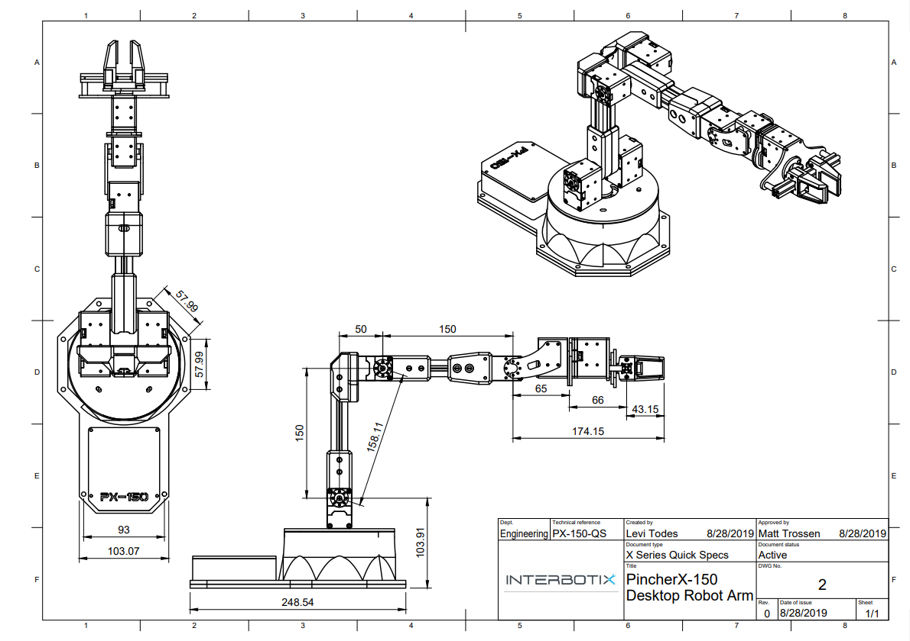

============
PincherX-150
============

The PincherX-150 Robot Arm belongs to the Interbotix X-Series family of arms featuring the
DYNAMIXEL X-Series Smart Servo Motors. The X-Series actuators offer high torque, efficient heat
dissipation and great durability all at a smaller form factor over previous DYNAMIXEL servos. The
DYNAMIXEL `XL430-W250`_ servos offer high resolution of 4096 positions and user definable PID
parameters, temperature monitoring, positional feedback, as well as voltage levels, load, and
compliance settings are user accessible as well. At the heart of the PincherX-100 is the Robotis
DYNAMIXEL U2D2 which enables easy access to DYNAMIXEL Wizard software as well as ROS. The
PincherX-150 offers 4 degree of freedom and a full 360 degree of rotation.

.. _`XL430-W250`: https://www.trossenrobotics.com/dynamixel-xl430-w250-t.aspx

.. list-table::
    :align: center

    * - .. image:: images/px150.png
            :align: center
            :width: 500px

      - .. table::
            :align: center

            +----------------------------------------+--------------------------------------+
            | **PincherX-150**                                                              |
            +========================================+======================================+
            | Degrees of Freedom                     | 5                                    |
            +----------------------------------------+--------------------------------------+
            | Reach                                  | 150mm                                |
            +----------------------------------------+--------------------------------------+
            | Total Span                             | 900mm                                |
            +----------------------------------------+--------------------------------------+
            | Repeatability                          | 5mm                                  |
            +----------------------------------------+--------------------------------------+
            | Accuracy                               | 8mm                                  |
            +----------------------------------------+--------------------------------------+
            | Working Payload                        | 50g*                                 |
            +----------------------------------------+--------------------------------------+
            | Total Servos                           | 8                                    |
            +----------------------------------------+--------------------------------------+
            | Wrist Rotate                           | Yes                                  |
            +----------------------------------------+--------------------------------------+

.. note::

    \* Working Payload for the PincherX-150 is inside its maximum reach, if intending to use a 50g
    weight we recommend no more than a 50% extension of the arm.

Default Joint Limits
====================

Default joint limits are the safe range of operation for each joint. These are set in the firmware,
defined as degrees from Zero (servo centered).

.. table::
    :align: center

    +--------------+-------+------+-------------+
    | Joint        | Min   | Max  | Servo ID(s) |
    +==============+=======+======+=============+
    | Waist        | -180  | 180  | 1           |
    +--------------+-------+------+-------------+
    | Shoulder     | -113  | 111  | 2+3         |
    +--------------+-------+------+-------------+
    | Elbow        | -120  | 95   | 4+5         |
    +--------------+-------+------+-------------+
    | Wrist Angle  | -100  | 123  | 6           |
    +--------------+-------+------+-------------+
    | Wrist Rotate | -180  | 180  | 7           |
    +--------------+-------+------+-------------+
    | Gripper      | 30mm  | 74mm | 8           |
    +--------------+-------+------+-------------+

Default Servo Configurations
============================

.. csv-table::
    :file: ../_data/servos_px150.csv
    :header-rows: 1
    :widths: 5 10 10 10
    :align: center

Kinematic Properties
====================

Product of Exponentials [`Learn More`_]
---------------------------------------

.. math::

    M & =
    \begin{bmatrix}
    1.0 & 0.0 & 0.0 & 0.358575 \\
    0.0 & 1.0 & 0.0 & 0.0      \\
    0.0 & 0.0 & 1.0 & 0.25457  \\
    0.0 & 0.0 & 0.0 & 1.0
    \end{bmatrix}

.. math::

    Slist & =
    \begin{bmatrix}
    0.0 & 0.0 & 1.0 &  0.0     & 0.0     & 0.0  \\
    0.0 & 1.0 & 0.0 & -0.10457 & 0.0     & 0.0  \\
    0.0 & 1.0 & 0.0 & -0.25457 & 0.0     & 0.05 \\
    0.0 & 1.0 & 0.0 & -0.25457 & 0.0     & 0.2  \\
    1.0 & 0.0 & 0.0 &  0.0     & 0.25457 & 0.0
    \end{bmatrix}^T

.. _`Learn More`: https://en.wikipedia.org/wiki/Product_of_exponentials_formula

Drawings and CAD Files
======================

:download:`PincherX-150 Technical Drawing </_downloads/PincherX-150.pdf>`

- :download:`PincherX-150 Solid STEP Files </_downloads/solids/2_PXA-150-M.zip>`
- `PincherX-150 Mesh STL Files <https://github.com/Interbotix/interbotix_ros_manipulators/tree/main/interbotix_ros_xsarms/interbotix_xsarm_descriptions/meshes/px150_meshes>`_
