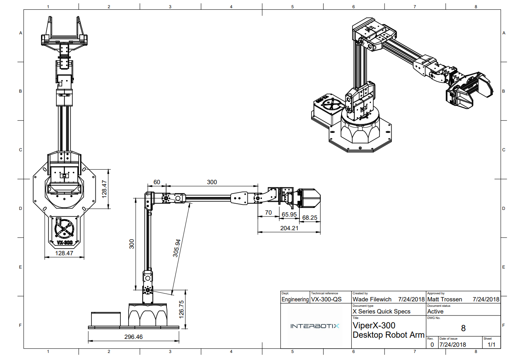

==========
ViperX-300
==========

Overview
========

The ViperX-300 Robot Arm belongs to the Interbotix X-Series family of arms featuring the DYNAMIXEL
X-Series Smart Servo Motors. The X-Series actuators offer high torque, efficient heat dissipation
and great durability all at a smaller form factor over previous DYNAMIXEL servos. The DYNAMIXEL
`XM540-W270`_ & DYNAMIXEL `XM430-W350`_ servos offer high resolution of 4096 positions and user
definable PID parameters, temperature monitoring, positional feedback, as well as voltage levels,
load, and compliance settings are user accessible as well. At the heart of the ViperX-300 is the
Robotis DYNAMIXEL U2D2 which enables easy access to DYNAMIXEL Wizard software as well as ROS. The
ViperX-300 offers 5 degree of freedom and a full 360 degree of rotation.

.. _`XM540-W270`: https://www.trossenrobotics.com/dynamixel-xm540-w270-t.aspx
.. _`XM430-W350`: https://www.trossenrobotics.com/dynamixel-xm430-w350-t.aspx

.. list-table::
    :align: center

    * - .. image:: images/vx300.png
            :align: center
            :width: 500px

      - .. table::
            :align: center

            +----------------------------------------+--------------------------------------+
            | **ViperX-300**                                                                |
            +========================================+======================================+
            | Degrees of Freedom                     | 5                                    |
            +----------------------------------------+--------------------------------------+
            | Reach                                  | 750mm                                |
            +----------------------------------------+--------------------------------------+
            | Total Span                             | 1500mm                               |
            +----------------------------------------+--------------------------------------+
            | Repeatability                          | 1mm                                  |
            +----------------------------------------+--------------------------------------+
            | Accuracy                               | 5 - 8mm                              |
            +----------------------------------------+--------------------------------------+
            | Working Payload                        | 750g*                                |
            +----------------------------------------+--------------------------------------+
            | Total Servos                           | 8                                    |
            +----------------------------------------+--------------------------------------+
            | Wrist Rotate                           | Yes                                  |
            +----------------------------------------+--------------------------------------+

.. note::

    \* Working Payload for the ViperX-300 is inside its maximum reach, if intending to use a 750g
    weight we recommend no more than a 50% extension of the arm.

Default Joint Limits
====================

Default joint limits are the safe range of operation for each joint. These are set in the firmware,
defined as degrees from Zero (servo centered).

.. table::
    :align: center

    +--------------+-------+-------+-------------+
    | Joint        | Min   | Max   | Servo ID(s) |
    +==============+=======+=======+=============+
    | Waist        | -180  | 180   | 1           |
    +--------------+-------+-------+-------------+
    | Shoulder     | -101  | 101   | 2+3         |
    +--------------+-------+-------+-------------+
    | Elbow        | -101  | 92    | 4+5         |
    +--------------+-------+-------+-------------+
    | Wrist Angle  | -107  | 130   | 6           |
    +--------------+-------+-------+-------------+
    | Wrist Rotate | -180  | 180   | 7           |
    +--------------+-------+-------+-------------+
    | Gripper      | 42mm  | 116mm | 8           |
    +--------------+-------+-------+-------------+

Default Servo Configurations
============================

.. csv-table::
    :file: ../_data/servos_vx300.csv
    :header-rows: 1
    :widths: 5 10 10 10
    :align: center

Kinematic Properties
====================

Product of Exponentials [`Learn More`_]
---------------------------------------

.. math::

    M & =
    \begin{bmatrix}
    1.0 & 0.0 & 0.0 & 0.536494 \\
    0.0 & 1.0 & 0.0 & 0.0      \\
    0.0 & 0.0 & 1.0 & 0.42705  \\
    0.0 & 0.0 & 0.0 & 1.0
    \end{bmatrix}

.. math::

    Slist & =
    \begin{bmatrix}
    0.0 & 0.0 & 1.0 &  0.0     & 0.0     & 0.0     \\
    0.0 & 1.0 & 0.0 & -0.12705 & 0.0     & 0.0     \\
    0.0 & 1.0 & 0.0 & -0.42705 & 0.0     & 0.05955 \\
    0.0 & 1.0 & 0.0 & -0.42705 & 0.0     & 0.35955 \\
    1.0 & 0.0 & 0.0 &  0.0     & 0.42705 & 0.0
    \end{bmatrix}^T

.. _`Learn More`: https://en.wikipedia.org/wiki/Product_of_exponentials_formula

Drawings and CAD Files
======================

:download:`ViperX-300 Technical Drawing </_downloads/ViperX-300.pdf>`

- :download:`ViperX-300 Solid STEP Files </_downloads/solids/8_VXA-300-M.zip>`
- `ViperX-300 Mesh STL Files <https://github.com/Interbotix/interbotix_ros_manipulators/tree/main/interbotix_ros_xsarms/interbotix_xsarm_descriptions/meshes/vx250_meshes>`_
