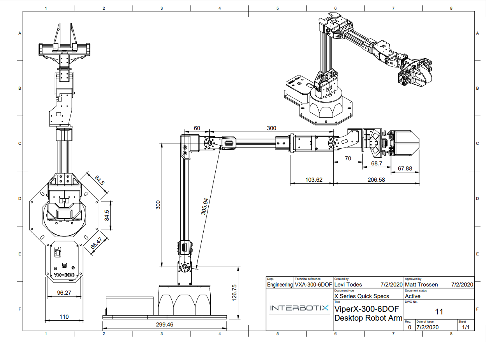

===============
ViperX-300 6DOF
===============

Overview
========

The ViperX-300 6DOF Robot Arm belongs to the Interbotix X-Series family of arms featuring the
DYNAMIXEL X-Series Actuators from Robotis. The X-Series actuators offer higher torque, more
efficient heat dissipation and better durability all at a smaller form factor over previous
DYNAMIXEL servos. The DYNAMIXEL `XM540-W270`_ & DYNAMIXEL `XM430-W350`_ servos offer high
resolution of 4096 positions and user definable PID parameters, temperature monitoring, positional
feedback, as well as voltage levels, load, and compliance settings are user accessible as well. At
the heart of the ViperX-300 6DOF is the Robotis DYNAMIXEL U2D2 which enables easy access to
DYNAMIXEL Wizard software as well as ROS. The ViperX-300 6DOF offers 6 degree of freedom and a full
360 degree of rotation.

.. _`XM540-W270`: https://store.trossenrobotics.com/products/dynamixel-xm540-w270-t-robot-actuator
.. _`XM430-W350`: https://store.trossenrobotics.com/products/dynamixel-xm430-w350-t-robot-actuator

The main advantage to using a 6 degree of freedom arm is the increased maneuverability it provides.
In general, the pose of an arm's end-effector can be described by its position (x, y, z) and
orientation (roll, pitch, yaw) in 3D space. While each of these six factors can be controlled
independently with a 6DOF arm, one or more of them must be constrained with lower dof arms.

.. list-table::
    :align: center

    * - .. image:: images/vx300s.png
            :align: center
            :width: 500px

      - .. table::
            :align: center

            +----------------------------------------+--------------------------------------+
            | **ViperX-300 6DOF**                                                           |
            +========================================+======================================+
            | Degrees of Freedom                     | 6                                    |
            +----------------------------------------+--------------------------------------+
            | Reach                                  | 750mm                                |
            +----------------------------------------+--------------------------------------+
            | Total Span                             | 1500mm                               |
            +----------------------------------------+--------------------------------------+
            | Repeatability                          | 1mm                                  |
            +----------------------------------------+--------------------------------------+
            | Accuracy                               | 5 - 8mm                              |
            +----------------------------------------+--------------------------------------+
            | Working Payload                        | 750g*                                |
            +----------------------------------------+--------------------------------------+
            | Total Servos                           | 9                                    |
            +----------------------------------------+--------------------------------------+
            | Wrist Rotate                           | Yes                                  |
            +----------------------------------------+--------------------------------------+

.. note::

    \* Working Payload for the ViperX-300 6DOF is inside its maximum reach, if intending to use a
    750g weight we recommend no more than a 50% extension of the arm.

Default Joint Limits
====================

Default joint limits are the safe range of operation for each joint. These are set in the firmware,
defined as degrees from Zero (servo centered).

.. table::
    :align: center

    +--------------+-------+-------+-------------+
    | Joint        | Min   | Max   | Servo ID(s) |
    +==============+=======+=======+=============+
    | Waist        | -180  | 180   | 1           |
    +--------------+-------+-------+-------------+
    | Shoulder     | -101  | 101   | 2+3         |
    +--------------+-------+-------+-------------+
    | Elbow        | -101  | 92    | 4+5         |
    +--------------+-------+-------+-------------+
    | Wrist Angle  | -107  | 130   | 6           |
    +--------------+-------+-------+-------------+
    | Forearm Roll | -180  | 180   | 7           |
    +--------------+-------+-------+-------------+
    | Wrist Rotate | -180  | 180   | 8           |
    +--------------+-------+-------+-------------+
    | Gripper      | 42mm  | 116mm | 9           |
    +--------------+-------+-------+-------------+

Default Servo Configurations
============================

.. csv-table::
    :file: ../_data/servos_vx300s.csv
    :header-rows: 1
    :widths: 5 10 10 10
    :align: center

Kinematic Properties
====================

Product of Exponentials
-----------------------

`Read more about the product of exponential approach.`_

.. math::

    M & =
    \begin{bmatrix}
    1.0 & 0.0 & 0.0 & 0.536494 \\
    0.0 & 1.0 & 0.0 & 0.0 \\
    0.0 & 0.0 & 1.0 & 0.42705 \\
    0.0 & 0.0 & 0.0 & 1.0
    \end{bmatrix}

.. math::

    Slist & =
    \begin{bmatrix}
    0.0 & 0.0 & 1.0 &  0.0      & 0.0      & 0.0 \\
    0.0 & 1.0 & 0.0 & -0.12705  & 0.0      & 0.0 \\
    0.0 & 1.0 & 0.0 & -0.42705  & 0.0      & 0.05955 \\
    1.0 & 0.0 & 0.0 &  0.0      & 0.42705  & 0.0 \\
    0.0 & 1.0 & 0.0 & -0.42705  & 0.0      & 0.35955 \\
    1.0 & 0.0 & 0.0 &  0.0      & 0.42705  & 0.0
    \end{bmatrix}^T

.. _`Read more about the product of exponential approach.`: https://en.wikipedia.org/wiki/Product_of_exponentials_formula

Drawings and CAD Files
======================

:download:`ViperX-300 6DOF Technical Drawing </_downloads/ViperX-300s.pdf>`

.. raw:: html

    <iframe
        src="https://trossenrobotics.autodesk360.com/shares/public/SH56a43QTfd62c1cd9680d0d9bb438fff39a?mode=embed"
        width="100%"
        height="600px"
        allowfullscreen="true"
        webkitallowfullscreen="true"
        mozallowfullscreen="true"
        frameborder="0">
    </iframe>

- :download:`ViperX-300 6DOF Solid STEP Files </_downloads/solids/9_VXA-300S-M.zip>`
- `ViperX-300 6DOF Mesh STL Files <https://github.com/Interbotix/interbotix_ros_manipulators/tree/main/interbotix_ros_xsarms/interbotix_xsarm_descriptions/meshes/vx300s_meshes>`_
